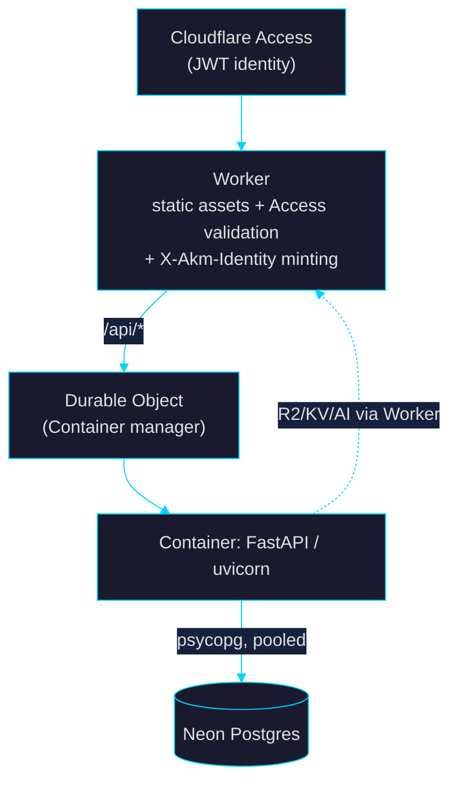

# akm

> _A toolkit for building full-stack apps on **Cloudflare** (Workers + Containers) with **Neon** Serverless Postgres — scaffold → dev → build → deploy — driven by a single **Zig** binary._

The full design, rationale, and the four-round adversarial review that shaped it live in **[`goal.md`](./goal.md)**. This README covers what's actually built so far.

---

## Status

| Phase (see `goal.md` §6) | State |
|---|---|
| Plan + adversarial review | ✅ approved (`goal.md`) |
| **P1** Cloudflare + Neon app templates | ✅ authored |
| **P2** Zig CLI: `init` · `dev` · `build` | ✅ done |
| **P3** `deploy` · `logs` · `components` · `preview` · codegen | ✅ done (Cloudflare paths dry-run-verified; Neon-branch lifecycle live-verified) |
| P0 cloud spike (live Containers/DO + Access deploy) | ⏸ deferred indefinitely (`scripts/p0-deploy.sh` ready) |

What works today — the full local lifecycle:

| Command | Does |
|---|---|
| `akm init <name> [dir]` | scaffold a complete, type-coherent Cloudflare + Neon FastAPI app from embedded templates |
| `akm dev [dir]` | one-origin local loop: reverse proxy + uvicorn + Vite, minting `X-Akm-Identity`; `--neon-branch` spins an ephemeral DB |
| `akm build [dir]` | OpenAPI → typed TS client (`openapi-typescript`) → `vite build` artifacts |
| `akm deploy [dir]` | build → secrets (`wrangler secret bulk`) → `wrangler deploy`; `--dry-run`, `--migrate`, `--env` |
| `akm logs [dir]` | live Worker tail (`wrangler tail`); container logs → Observability dashboard (§5 caveat printed) |
| `akm components init \| add <name…>` | make the app shadcn-ready, then fetch shadcn/ui components over HTTPS |
| `akm frontend install \| add \| dev \| build \| typecheck` | UI-only npm/Vite toolchain — work on the frontend in isolation (`frontend dev` = Vite alone, no proxy; `frontend build` = `vite build` only, no codegen) |
| `akm preview create \| destroy --pr <id>` | per-PR named Worker + ephemeral Neon branch (CI calls these on PR open/close) |

## Build

Requires **Zig 0.16.0**.

```bash
cd cli
zig build            # → zig-out/bin/akm
zig build test       # 35 tests: render, slug, jwt, neon, proxy, deploy, components, logs, preview
./zig-out/bin/akm init "My App" ./my-app
cd my-app && uv sync && npm install
akm dev              # http://localhost:8787  (proxy + uvicorn + Vite)
```

## Architecture (target)



The single security boundary (`goal.md` §4.5): the **Worker** validates the
Cloudflare Access JWT, strips all spoofable client headers, and mints one
short-lived HS256 **`X-Akm-Identity`** that the container alone trusts.

## What's verified

- `akm init` renders 24 files with `{{var}}` substitution + `__pkg__` path tokens, no leftover tags.
- **`akm dev` end-to-end** (live): `/api/*`→uvicorn, `/*`→Vite on one origin; the proxy injects a valid `X-Akm-Identity` and **strips forged client identity headers**; WebSocket/HMR tunnels through; Ctrl-C tears down all child process groups in ~1–2 s. A real `--neon-branch` run created an ephemeral branch, round-tripped `/api/db-check` against Neon, and deleted the branch on exit.
- **`akm build`**: emits `openapi.json` (build-mode import — **no DB, secrets, or network**), the typed TS client, and `dist/`.
- **`akm deploy --dry-run`**: builds, then `wrangler` validates `wrangler.jsonc` + bundles the Worker (DO + Assets bindings) without an account/Docker.
- **`akm components`**: `init` makes the app shadcn-ready and `add` fetches components over HTTPS — verified by a successful `npm run build` that compiles Tailwind and resolves the `@/` alias.
- **Cross-language auth check:** a token minted by the exact `auth.ts` (Worker) HS256 algorithm is accepted by the Python `identity.py`; tampered / wrong-key tokens are rejected with 401 (§4.5).
- All generated Python byte-compiles.

## Repo layout

```
goal.md                 The reviewed migration plan (source of truth)
scripts/p0-deploy.sh    Idempotent live-deploy runbook (P0 spike, deferred)
cli/
  build.zig(.zon)       Zig 0.16 build; embeds templates via a generated manifest
  src/
    main.zig            arg dispatch
    render.zig          minimal {{var}} + {{#if}}/{{#unless}} engine (tested)
    project.zig         shared: open project, discover pkg, env, .vars parser
    jwt.zig             mint X-Akm-Identity (HS256), matches identity.py
    proxy.zig           dev reverse proxy: routing + identity inject + WS tunnel
    neon.zig            ephemeral Neon branch lifecycle (neonctl)
    commands/
      init.zig          scaffolder
      dev.zig           local dev orchestrator (proxy + uvicorn + Vite + signals)
      build.zig         openapi.json → openapi-typescript → vite build
      deploy.zig        wrangler deploy + secret bulk + alembic migrate
      logs.zig          wrangler tail live Worker tail + §5 container-log caveat
      components.zig    shadcn registry fetch/add over HTTPS + shadcn-ready init
      frontend.zig      UI-only npm/Vite toolchain wrapper (install/add/dev/build/typecheck)
      preview.zig       per-PR named Worker + ephemeral Neon branch (create/destroy)
  templates/base/       the generated-app templates (Worker, Container, FastAPI, Neon, Alembic)
```

## License

TBD.
