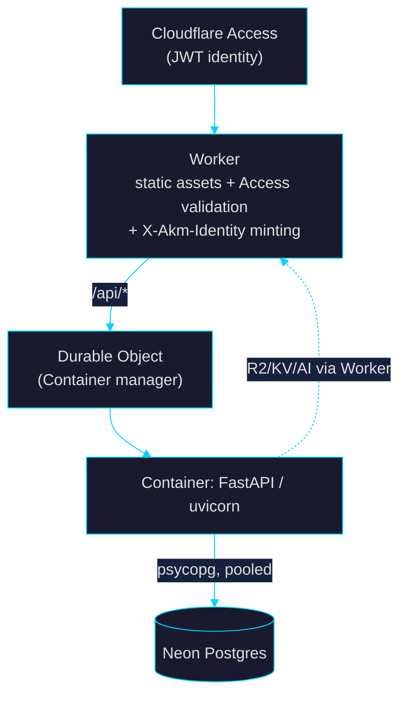

# akm

> _A toolkit for building full-stack apps on **Cloudflare** (Workers + Containers) with **Neon** Serverless Postgres — scaffold → dev → build → deploy — driven by a single **Zig** binary._

The full design, rationale, and the four-round adversarial review that shaped it live in **[`goal.md`](./goal.md)**. This README covers what's actually built so far.

---

## Status

| Phase (see `goal.md` §6) | State |
|---|---|
| Plan + adversarial review | ✅ approved (`goal.md`) |
| **P1** Cloudflare + Neon app templates | ✅ authored |
| **P2** Zig CLI: `init` | ✅ working (`init`); `dev`/`build`/`deploy` stubbed |
| P0 cloud spikes (Containers/DO, Neon, Access live) | ⏳ needs a CF/Neon account |

What works today: `akm init` scaffolds a complete, type-coherent Cloudflare + Neon
FastAPI app from templates embedded in the binary.

## Build

Requires **Zig 0.16.0**.

```bash
cd cli
zig build            # → zig-out/bin/akm
zig build test       # render-engine + slug tests
./zig-out/bin/akm init "My App" ./my-app
```

## Architecture (target)



The single security boundary (`goal.md` §4.5): the **Worker** validates the
Cloudflare Access JWT, strips all spoofable client headers, and mints one
short-lived HS256 **`X-Akm-Identity`** that the container alone trusts.

## What's verified

- `akm init` renders 24 files with `{{var}}` substitution + `__pkg__` path tokens, no leftover tags.
- The generated FastAPI app imports under `AKM_OPENAPI_BUILD=1` with **no DB, secrets, or network**, and emits a valid OpenAPI schema (the codegen build-mode contract, §4).
- **Cross-language auth check:** a token minted by the exact `auth.ts` (Worker) HS256 algorithm is accepted by the Python `identity.py`; tampered / wrong-key tokens are rejected with 401 (§4.5).
- All generated Python byte-compiles.

## Repo layout

```
goal.md                 The reviewed migration plan (source of truth)
cli/
  build.zig(.zon)       Zig 0.16 build; embeds templates via a generated manifest
  src/
    main.zig            arg dispatch
    render.zig          minimal {{var}} + {{#if}}/{{#unless}} engine (tested)
    commands/init.zig   scaffolder
  templates/base/       the generated-app templates (Worker, Container, FastAPI, Neon, Alembic)
```

## License

TBD.
