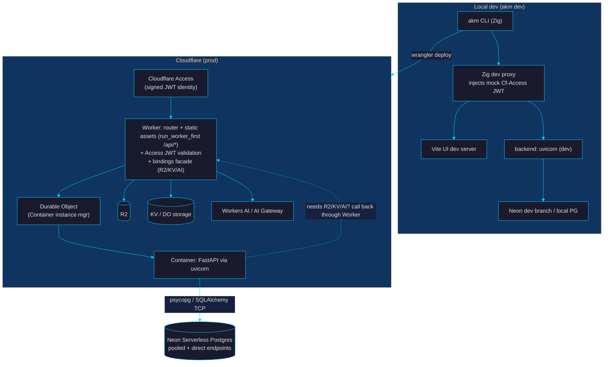
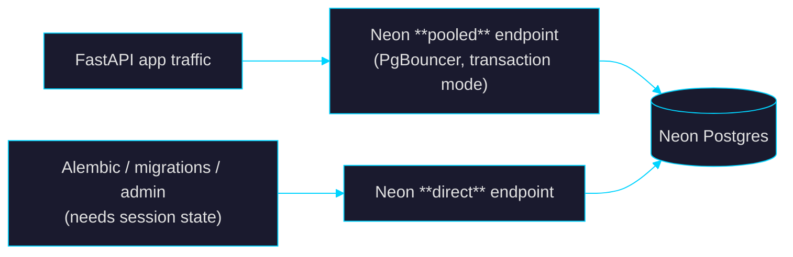

# akm — design & build plan

> **What:** akm is a toolkit for building full-stack web apps on **Cloudflare** (Workers / Containers / R2 / KV / Durable Objects / Workers AI / Access) with **Neon Serverless Postgres** for OLTP. A single **Zig** binary drives the lifecycle: scaffold → dev → build → deploy, with typed-client codegen and a React/shadcn UI.
>
> **Why:** Give app developers a fast, AI-friendly, batteries-included DX on a serverless edge platform with pay-per-use Postgres — no bespoke runtime to operate.
>
> _Revision 4 — incorporates four rounds of adversarial Codex review (verified against Cloudflare/Neon docs, early 2026); final verdict: approved to execute. See §9 for the review log._

---

## 0. The runtime thesis (read this first)

akm serves Python apps; it does **not** embed a language runtime of its own.

- The backend is a normal **FastAPI/ASGI** app run under stock **`uvicorn`** inside a **Cloudflare Container**. Cloudflare Containers are built for exactly this: arbitrary Linux runtimes from your own image.
- There is **no reason to build a custom CPython host** (e.g. embedding CPython via FFI from Zig): a Dockerfile + uvicorn already gives multi-worker serving for free, and reimplementing CPython embedding would be months of work for no benefit.
- **Therefore the Zig binary is an orchestrator, not a runtime:** it does **local dev orchestration + scaffolding + codegen + build/deploy driving.** Production serving belongs to Cloudflare — **Containers** for the Python backend, **Workers** for the edge router / static-asset / auth layer.

This is the spine of the design. §8 confronts the strongest counter-argument (that this leaves too little to justify a *binary* at all) and sets a kill-gate.

---

## 1. Subsystems akm must provide

Every full-stack toolkit has to answer the same questions; here is akm's answer for each, all on Cloudflare + Neon. Details follow in §§2–5.

| # | Concern | akm's implementation |
|---|---|---|
| 1 | **CLI / dev account auth** | Cloudflare API token + `wrangler login` OAuth (the Zig binary shells out to `wrangler`) |
| 2 | **End-user auth** | **Cloudflare Access** in front of the Worker; the Worker validates the Access JWT (§4.5) |
| 3 | **Service-to-service auth** | Cloudflare **service tokens** → mapped to a service principal (§4.5) |
| 4 | **Request identity into the backend** | Worker mints a short-lived internal `X-Akm-Identity` JWT the container alone trusts (§4.5) |
| 5 | **OLTP database** | **Neon Serverless Postgres**, dual pooled/direct endpoints (§3) |
| 6 | **Schema migrations** | **Alembic**, run over the Neon direct endpoint (§3) |
| 7 | **Build artifacts** | `Dockerfile` (backend image) + built UI + Worker entry + `wrangler.jsonc` (§5) |
| 8 | **Deploy** | `wrangler deploy` (containers + Durable Object + assets), driven by `akm deploy` (§5) |
| 9 | **Typed API client** | OpenAPI (from the FastAPI app) → `openapi-typescript` (§4) |
| 10 | **Object storage / LLM / KV** | **R2 / Workers AI / KV / Durable Objects**, opt-in, reached from the Worker (§2) |
| 11 | **Logs / observability** | Workers Observability (dashboard + Logs); `wrangler tail` for live tail (§5) |

> **Out of scope (v1):** an analytics/warehouse layer (akm targets app OLTP, not analytics), the MCP server (deferred to v2), and any non-Postgres primary store.

---

## 2. Architecture (Cloudflare + Neon + Zig)

> **Framing note:** this is **not** "edge-native FastAPI." Cloudflare Containers are **globally-scheduled HTTP compute**, not Worker-style edge isolates. A Container instance is backed by a Durable Object; the DO and its container are **not guaranteed colocated**, routing is sticky-to-instance or random (not latency-based), instances **cold-start** and sleep, and Neon adds regional round-trips. The honest pitch is "managed serverless compute + Postgres with great DX," not "FastAPI at the edge."

### Components

| Component | Implementation | Notes |
|---|---|---|
| Prod backend host | **Cloudflare Containers** (Python/uvicorn) fronted by a **Worker** (router/static/Access) | Container is **DO-backed** — requires a `Container` class, DO binding + migration, instance-ID/routing policy (§5). Worker-only mode (no Python) is the lighter alternative. |
| OLTP | **Neon Serverless Postgres** | §3 |
| End-user identity | **Cloudflare Access** (user) + **service tokens** (service) | Worker **validates** the Access JWT (§4.5) |
| Deploy | **Wrangler** + `wrangler.jsonc` | §5 |
| LLM | **Workers AI** + **AI Gateway** | addon, not baseline; one `ai` binding per Worker; reachable only from the Worker, not directly from the Python container (§4.5) |
| Object storage | **R2** | reachable from the Worker; the Python container accesses it via the Worker facade or S3-API creds |
| Secrets | **Wrangler secrets** | |
| Logs | **`wrangler tail` (live) + Workers Logs / Logpush (export, paid/Enterprise tiers)** | §5 |
| Extra primitives | **KV, Durable Objects, Queues, D1** | **opt-in addons**. D1 is SQLite, **not** a Neon/Postgres replacement. |

---

## 3. OLTP: Neon

App data lives in **Neon Serverless Postgres**, accessed from the FastAPI container via SQLAlchemy/psycopg.

**`neon.py` (the connection layer):**
- Connection string comes from a `DATABASE_URL` secret. v1 auth = **static role+password in `DATABASE_URL`** (secret-managed).
- **Two URLs, not one:** app traffic → Neon **pooled** endpoint (`-pooler` host, PgBouncer *transaction* mode); Alembic/migrations/admin and anything needing **session state** (`SET`, `LISTEN/NOTIFY`, session advisory locks, SQL-level `PREPARE`/`DEALLOCATE`, temp tables) → Neon **direct** endpoint. Ship both as `DATABASE_URL` (pooled) and `DATABASE_URL_DIRECT` (direct). _Note: Neon's PgBouncer supports **protocol-level** prepared statements, so most ORM usage is fine on the pooler — the breakage is session-scoped SQL and session features, not all prepared statements._
- **Pool resilience (must be in `neon.py`):** Neon computes **scale to zero** (~hundreds-of-ms cold start on first query after idle) and Containers sleep — so the engine must tolerate dropped/cold connections. Set a **bounded** app pool (`pool_size`/`max_overflow` small, since the pooler multiplexes), `pool_pre_ping=True`, a `pool_recycle` shorter than Neon's idle timeout, and connect-retry with backoff on the first query. Require SSL (`sslmode=require`).
- Dev mode: a local-Postgres path **and** a Neon-dev-branch path (`akm dev --neon-branch` creates an ephemeral branch and exports its URLs).
- Migrations: **Alembic** over the direct endpoint, scoped to P1. (v1 may bootstrap with `SQLModel.metadata.create_all`.)

**Per-request identity / RLS (v2 addon):** Neon's per-request-JWT authorization (`pg_session_jwt` / "Neon Authorize" / the Neon **Data API**) is an **HTTP / serverless-driver path**, *not* something you bolt onto a psycopg/SQLAlchemy TCP session. So "pass the Cloudflare Access identity into the DB for row-level security" is only real via the Neon Data API or the `@neondatabase/serverless` HTTP driver — which means it lives in a **Worker**, or a dedicated Python HTTP path, **not** in the container's SQLAlchemy session. v1 does **not** attempt this; v2 is scoped as "RLS via Neon Data API from the Worker layer," marked uncertain pending a spike.

**Preview databases:** Neon **database branching per preview deploy** (an isolated branch per PR, torn down on merge) — driven by the Neon CLI / Platform API. See §5 for why this attaches to **per-PR Worker environments**, not Wrangler preview URLs.

---

## 4. The Zig binary (`akm`)

**Targets Zig 0.16.x, TigerStyle discipline.** It orchestrates external toolchains (Vite, `wrangler`, Docker, `uv`/`uvicorn`, `openapi-typescript`, Neon CLI) via subprocesses; it does not reimplement them.

### Commands

| Command | Status | Approach |
|---|---|---|
| `init` | ✅ built | scaffolder: render embedded templates (`@embedFile`) via a small template engine |
| `dev` | planned | orchestrate Vite + uvicorn + Neon-branch/local-PG; reverse proxy; mock Access JWT; file-watch reload |
| `build` | planned | codegen → vite build → assemble Worker + Container (Dockerfile) artifacts |
| `deploy` | planned | wrap `wrangler deploy`; manage secrets, bindings, DO migration, Neon branch |
| `logs` | planned | wrap `wrangler tail` (with documented limits, §5) |
| `components` | planned | shadcn registry fetch/add (HTTP + file writes) |
| `frontend` | planned | thin wrapper over Bun/Vite/npm |
| `mcp` | v2 | JSON-RPC over stdio in Zig |

> akm intentionally has **no `serve` command** — production serving is Cloudflare's job (§0).

### The four genuinely hard sub-problems (and the escape hatch for each)

1. **OpenAPI → TS client codegen.**
   → **Do not parse ASTs in Zig.** Emit `openapi.json` by importing the FastAPI app in a Python subprocess (`app.openapi()`), then run the npm tool **`openapi-typescript`**. Zig only orchestrates.
   → **Build-mode import contract:** importing the app for `app.openapi()` must be **side-effect-light** — no live DB connect, no Cloudflare/Neon network calls, no secret requirement, no lifespan startup. The Zig builder sets `AKM_OPENAPI_BUILD=1`; the templates' `create_app`/lifespan **must** short-circuit on that flag (skip `validate_db`, `create_all`, engine creation, Access config). Enforced by a P1 test that runs the import with no env/secrets.
2. **Template engine.**
   → Minimal `{{var}}` + `{{#if}}/{{#unless}}` engine in Zig (we own the templates). _(Built — see `cli/src/render.zig`.)_
3. **Dev reverse proxy.**
   → Small HTTP/1.1 reverse proxy on `std.http`; `/api/*` → uvicorn, `/*` → Vite, inject a mock `Cf-Access-Jwt-Assertion`. **WebSocket/HMR passthrough is the top risk** — spike early; documented fallback: let Vite HMR connect directly to its own port.
4. **File watching.**
   → Wrap `kqueue`/`inotify` directly, or debounced polling for v1. Lowest stakes.

### Zig dependency budget
`std` (HTTP client/server, JSON, child process, fs) + at most: a CLI arg parser, an HTTP/WS helper if `std.http` is insufficient, and SQLite C bindings (only if a local logs/FTS DB is retained). Heavy lifting (Vite, Bun, wrangler, openapi-typescript, uv, docker) stays as **subprocess calls**.

### 4.5 Auth design — one contract, no ambiguity

There is exactly **one** trust boundary the Python backend cares about: an **internal assertion** minted by the Worker (or, in dev, the Zig proxy). The container **never** trusts client-supplied identity headers.

The single contract, in strict order:

1. **Worker is the only identity authority.** On every request, **in this order**:
   1. **Validate first.** Verify `Cf-Access-Jwt-Assertion` against the team JWKS (`https://<team>.cloudflareaccess.com/cdn-cgi/access/certs`): check signature, `aud` (the Access app AUD tag), `iss`, `exp`/`nbf`/`iat`. Reject (401) on failure. Extract `email`, `sub`, and (for service tokens) `common_name`.
   2. **Then build a sanitized downstream request:** drop **every** incoming `Cf-Access-*`, `X-Forwarded-*`, and `X-Akm-*` header from the client (spoofable on any route not actually behind Access), and attach exactly one minted header.
   3. **Mint one internal assertion** → `X-Akm-Identity`. Nothing else identity-bearing crosses to the container.
2. **Internal `X-Akm-Identity` JWT — exact schema** (signed with `AKM_INTERNAL_JWT_KEY`):
   - Header: `alg: "HS256"` (HMAC; symmetric key shared Worker↔container), `typ: "JWT"`.
   - Claims: `iss: "akm-worker"`, `aud: "akm-backend"`, `iat`, `nbf`, `exp` (≤120 s TTL), `sub` (the principal id), `kind: "user" | "service"`, and `email` (present iff `kind=user`).
   - Container validation: verify HMAC, `iss`, `aud`, `exp`/`nbf`, and that `kind ∈ {user,service}`; reject otherwise. One code path, prod and dev.
3. **Service-to-service principal mapping:** Cloudflare service-token Access JWTs have an **empty `sub`**. The Worker derives a **stable service principal** from `common_name` (falling back to the service-token id) and mints `{kind:"service", sub:"svc:<common_name>"}` with **no `email`**. Service tokens therefore identify a *service*, not a user, and **cannot** drive per-user RLS.
4. **Dev:** the Zig proxy mints the **same** `X-Akm-Identity` JWT (same `AKM_INTERNAL_JWT_KEY`, same claim schema), so the container's validation path is byte-for-byte identical to prod. No Access round-trip locally.

> **Operational note:** in prod the Worker only sees a validatable Access JWT if a **Cloudflare Access application + policy** is configured for the route. Generated apps **must** ship that config (or document the manual step) or every request 403s by design.

---

## 5. Build & deploy: Wrangler + Containers

**Prerequisites (must be surfaced in `init`/docs):** Cloudflare **Workers Paid** plan (Containers are not on the free tier), local **Docker** running at deploy time, images built for **linux/amd64**, image-size/registry limits, an instance-size choice, **cold starts**, and a **multi-minute provisioning delay on first deploy**. This is materially heavier than "just `wrangler deploy`."

**Container mode (primary) requires a real DO-backed design:**
- A `Container`-subclass Durable Object (via Cloudflare's `@cloudflare/containers` helper) that owns the container lifecycle (`start`, `sleepAfter`, health/wait).
- A **Durable Object binding** + a **migration** (`new_sqlite_classes`) in `wrangler.jsonc`.
- An **instance-ID / routing strategy**: `getContainer(env.MY_CONTAINER, id)` for sticky single-tenant, or `getRandom(...)` for N stateless replicas (with the documented caveat that routing is not latency-aware and sticks to wherever an instance started).
- The Worker routes `/api/*` to the container DO and serves static assets otherwise.

**`wrangler.jsonc` (syntax):** JSONC uses object keys `"containers"`, `"assets"`, `"durable_objects"`, `"migrations"`, `"observability"` — **not** TOML `[table]` headers. Static-asset + API coexistence uses `"assets": { ..., "run_worker_first": ["/api/*"], "not_found_handling": "single-page-application" }` so `/api/*` hits the Worker (and container), unknown deep-links fall back to `index.html` (SPA refresh), and everything else is served as static assets. Generated config also sets `"observability": { "enabled": true }`.

**`akm build`** produces, by mode:
- **Container mode:** `Dockerfile` (uvicorn + FastAPI), built UI in `dist/`, a Worker entry (`src/worker/index.ts`: Access validation + static assets + container routing + bindings facade), the `Container` DO class, and `wrangler.jsonc` (containers + DO + migration + assets + secrets/bindings).
- **Worker-only mode (no Python):** UI assets + a Worker that talks to Neon via `@neondatabase/serverless`.

**`akm deploy`** → `wrangler deploy` (+ `wrangler secret put DATABASE_URL` / `DATABASE_URL_DIRECT`, etc.).

**Previews:** Container Workers implement a Durable Object, and **Wrangler/Workers Preview URLs are not generated for Workers that implement a Durable Object** — so the "preview URL + ephemeral Neon branch" idea **does not work for Container mode.** Instead use **per-PR named Worker environments/routes** (e.g. `myapp-pr-123`) paired with a **per-PR Neon branch**, torn down on merge. Worker-only mode *can* use native preview URLs (but those have no logs and are public by default).

**Logs:** primary log access is **Workers Observability** (dashboard + Workers Logs, with `observability.enabled=true`), which captures Worker logs and has retention limits per tier. Whether `wrangler tail` reliably streams **container** stdout/stderr is **not assumed** — it is a **P0 verification item**; until proven, `akm logs` documents the Observability dashboard as the source of truth for container logs and treats `wrangler tail` as best-effort live Worker tail. Durable export (Logs/Logpush) is gated to paid/Enterprise tiers. `akm logs` documents the limits rather than implying a managed log feed.

---

## 6. Phased plan

| Phase | Deliverable | Exit criteria |
|---|---|---|
| **P0 Spikes** | De-risk the 4 hard CLI problems **+ the DO-backed Container path + Neon dual-endpoint connect + Access→internal-JWT chain + container-log access** | A hand-built Worker→DO→Container FastAPI app, behind Access (JWT validated → internal `X-Akm-Identity` minted/verified), talking to Neon (pooled + direct, survives scale-to-zero), deployed via `wrangler`. **Verify** whether `wrangler tail` streams container stdout/stderr (else dashboard-only). Cold-start + first-deploy provisioning time **measured**. Zig proxy with mock-JWT injection + HMR works (or fallback chosen). |
| **P1 Templates** | `neon.py` (dual URL), Access-JWT auth, `worker/index.ts` + `Container` DO class, `wrangler.jsonc`, `Dockerfile`, Alembic | Generated app builds & deploys by hand (no Zig CLI yet) — _templates authored_ |
| **P2 Zig core** | `init`, `build`, `dev` in Zig | `akm init && akm dev` runs a full local app against a Neon dev branch — _`init` built_ |
| **P3 Zig deploy** | `deploy`, `logs`, `components`, codegen orchestration, per-PR env + Neon branch | `akm deploy` ships to Cloudflare; typed TS client regenerates |
| **P4 Polish** | secrets UX, per-PR preview automation, telemetry via `wrangler tail`/Logs, docs | green e2e on a non-trivial sample app |
| **P5 (opt)** | MCP server; Workers-AI addon; **Neon Data API RLS addon** (Worker-layer); KV/DO/R2/D1/Queues addons | each independent |

---

## 7. (reserved)

---

## 8. Risks, adversarial objections, rebuttals

| Objection | Response |
|---|---|
| **"A Zig *binary* is overkill — a template repo + a few shell scripts captures most of the value with far less maintenance."** (the strongest whole-approach objection) | Taken seriously, and **not** defended with a "dependency-free install" claim — that would be false, since the binary shells out to Bun/Vite, `openapi-typescript`, Python/`uv`/`uvicorn`, Wrangler, Docker, and the Neon CLI/API. Those toolchains are still required. The binary's only honest value is as a **single-entry orchestrator**: one command that sequences the multi-process `dev` loop (proxy + mock-identity JWT + Vite + uvicorn + Neon-branch lifecycle + watch), the build graph (codegen → vite → Docker → wrangler), and per-PR env/branch wiring — replacing an error-prone pile of shell glue. **Decision gate at end of P2:** if that orchestration doesn't clearly beat a `package.json`-scripts + `wrangler`/`vite` template, we ship the template and **cancel the Zig binary.** The binary is a means, not a requirement. |
| "Why not embed Python in the binary for speed?" | §0: Cloudflare runs the Container; a Dockerfile + uvicorn already gives multi-worker serving. Embedding CPython buys nothing the platform doesn't already provide, and costs months. |
| "Containers aren't edge; placement/cold-start/routing caveats." | Acknowledged in §2; no "edge-native FastAPI" claim. P0 measures cold start. Worker-only mode exists for genuinely edge-latency-sensitive light apps. |
| "Container ↔ KV/R2/AI isn't direct from Python." | Correct (§4.5/§2): those bindings live on the Worker. The container reaches them via a Worker facade (HTTP) or explicit secret/env plumbing (e.g. R2 S3-API creds). Addons must ship that bridge or state "Worker-only." |
| "Access email headers are spoofable." | Fixed in §4.5: Worker validates the Access **JWT** against JWKS/AUD; the container trusts only the Worker's minted `X-Akm-Identity`. |
| "Static DB creds are weaker than per-request credentials." | v1 = secret-managed `DATABASE_URL`. v2 per-request RLS is **only** via the Neon Data API/HTTP path from the Worker (§3), not psycopg TCP — marked uncertain pending a spike, not promised. |
| "Pooled Postgres breaks session features." | Fixed: dual endpoints (pooled for app, direct for migrations/session-state) — §3. |
| "Container previews are broken (DO ⇒ no preview URL)." | Fixed: per-PR Worker environments + per-PR Neon branch — §5. |
| "Logs aren't a managed feed." | §5 documents `wrangler tail` limits (no preview tail, retention, paid Logpush) rather than implying parity with a hosted log service. |
| "Scope is huge." | Phased; each phase demoable; MCP/analytics cut from v1; **P2 decision gate can cancel the binary entirely.** |

### Open questions to resolve in P0
- Container vs Worker-only as the default `init` choice?
- Keep a local logs/FTS SQLite DB, or drop it (removes the only Zig-SQLite need)?
- Single Zig binary vs Zig CLI + small TS helper for codegen (Bun is already a dep)?
- Is the Zig binary justified at all vs a template+scripts repo? (P2 decision gate.)
- Cloudflare Access required, or optional behind a flag, for `init`?

---

## 9. Review log
_Four adversarial Codex rounds, each fact-checked against live Cloudflare/Neon docs. Listed chronologically._

- **Rev 1 — initial plan.**
- **Rev 2 — after Codex round 1** (which raised 4 BLOCKERs + several MAJORs). Incorporated: runtime thesis corrected (Containers *can* run long-lived processes — the reason to use stock uvicorn is simplicity, not platform limits); Container mode requires DO + `new_sqlite_classes` migration + routing design (§5); Container previews broken under DOs → per-PR Worker envs + Neon branches (§5); Neon per-request RLS is an HTTP/Data-API story, not psycopg TCP (§3); split pooled/direct Neon endpoints (§3); Access JWT must be validated (headers spoofable; service tokens have empty `sub`) (§4.5); Container↔bindings bridge made explicit (§2/§4.5); "edge FastAPI" language downgraded (§2); deploy prerequisites surfaced (§5); `wrangler.jsonc` object syntax + `run_worker_first` fixed (§5); log-parity claim dropped (§5); strongest "why a binary at all" objection answered with a P2 cancel gate (§8).
- **Rev 3 — after Codex round 2** (0 BLOCKERs; 5 MAJORs). Resolved: single auth contract — Worker strips client identity, validates Access JWT, mints one internal `X-Akm-Identity` JWT, container validates only that, dev proxy mints the same (§4.5); binary value-prop honesty — orchestrator, not dependency-free (§8); OpenAPI build-mode import contract `AKM_OPENAPI_BUILD=1`, side-effect-light (§4); Neon prepared-statement wording corrected + pool resilience for scale-to-zero (§3); container-log claim downgraded to Observability-dashboard + P0 verification, `observability.enabled` added (§5); SPA `not_found_handling` fallback + prod-Access-app-required note (§5).
- **Rev 4 — after Codex round 3** (verdict APPROVE-WITH-NITS; 6/7 majors fully resolved). Tightened the remaining auth nit: exact `X-Akm-Identity` JWT schema (HS256, `iss`/`aud`/`iat`/`nbf`/`exp≤120s`/`sub`/`kind`/`email?`) + validation checks; explicit ordering (validate Access JWT → then sanitize/strip headers → forward); service-token principal mapping from `common_name`/token-id with empty-`sub` handling (§4.5).
- **Round 4 (confirmation):** verified all nits, judged §4.5 self-consistent and implementable as a security boundary, found no remaining Cloudflare/Neon factual error. Approved to execute.

## 10. Definition of done
1. This plan survives adversarial review with no unaddressed BLOCKER/MAJOR.
2. Every subsystem in §1 has a concrete Cloudflare/Neon implementation or an explicit deferral.
3. The Zig binary's scope is honestly bounded — including a gate that can cancel it.
4. The §0 runtime thesis is stated with the correct rationale.
